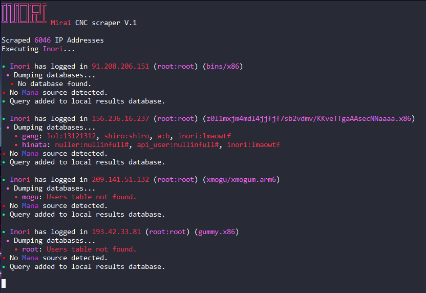

# Inori Mirai CNC Scraper V.1 - By Lore<3

### A working Mirai CNC scraper written in python.




## Features:
```bash
- Dumps MYSQL databases (CNC login credentials).
- Kills Mana V4.1 sources.
- Stores results into a json file.
```

## 🔌 How To Install:
```bash
1. git clone https://github.com/PyLore/Inori-Mirai-CNC-Scraper-V.1
2. cd <directory folder is in>
3. py main.py or python3 main.py
```
